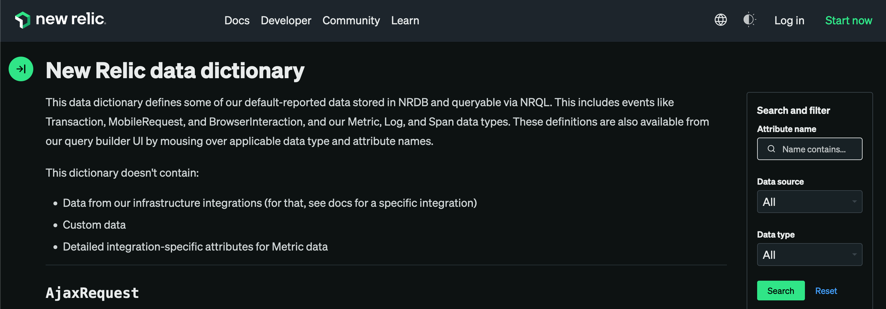
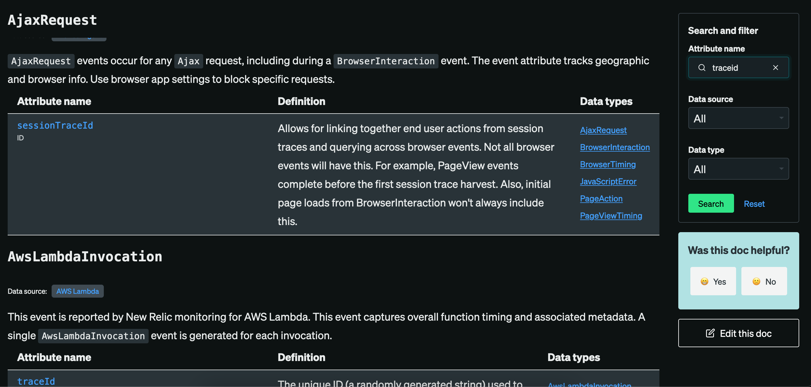
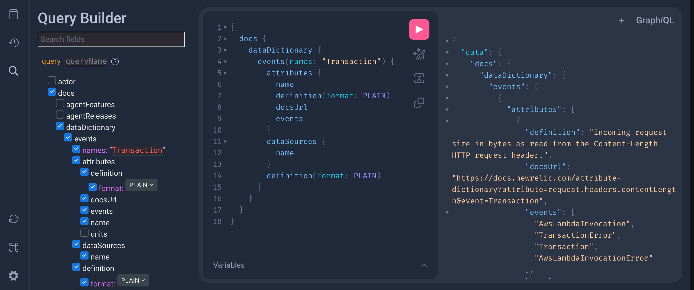

+++
title = "NRQL Bonanza"
outputs = ["Reveal"]
+++

# NRQL Bonanza 
# 🎉

Get more our of your data with NRQL!

---


### Carl Chesser

* Sr. Principal Engieer @ Oracle (formerly Cerner)
* 18 years in software development 
* Used New Relic ~ 5 years

---

# About this Talk
## Exploring NRQL 🔍

* Assume you know about the New Relic Query Langauge (NRQL)
* Short exploration around learning more about your data
* Includes some short exploration of NerdGraph (GraphQL)

---

# Data Dictionary

https://docs.newrelic.com/attribute-dictionary/



---

Search for attributes across entities



---

Data Dictionary in NerdGraph!

```graphql{}
{
  docs {
    dataDictionary {
      events(names: "Transaction") {
        attributes {
          name
          definition(format: PLAIN)
          docsUrl
          events
          units {
            label
          }
        }
        dataSources {
          name
        }
        definition(format: PLAIN)
      }
    }
  }
}
```

---

Helpful if you are wanting to extract more data into other formats for sharing...



---

# Usage

Use NRQL to understand more about your data

* NrConsumption
* NrDailyUsage
* `bytecountestimate` function on entities

---

# Usage

`bytecountestimate`, as the name implies, [is an estimate](https://docs.newrelic.com/docs/accounts/accounts-billing/new-relic-one-pricing-billing/usage-queries-alerts/#byte-count-estimate).

```sql{}
SELECT uniqueCount(apmAppName) 
FROM NrDailyUsage
FACET capture(apmAppName, r'(?P<appName>.*)\[.*') 
SINCE 30 days ago TIMESERIES 1 day
```

---

# Usage

NrDailyUsage to look at counts of application (what for spikes of growth)

```sql{}
SELECT uniqueCount(apmAppName) 
FROM NrDailyUsage
FACET apmAppName
SINCE 30 days ago TIMESERIES 1 day
```

---

# Usage

NrDailyUsage to look at counts of application, by categorizing on a application name prefix.

```sql{}
SELECT uniqueCount(apmAppName) 
FROM NrDailyUsage
-- Facet by application name prefix if you have (dash)
FACET capture(apmAppName, r'(?P<appName>.*)\-.*') 
SINCE 30 days ago TIMESERIES 1 day
```

---

# Usage

Compare metrics ingestion over 4 weeks to previous 4 weeks.

```sql{}
SELECT sum(GigabytesIngested) AS avgGbIngestTimeseries
FROM NrConsumption 
WHERE productLine = 'DataPlatform' 
AND usageMetric = 'MetricsBytes'
SINCE 4 weeks ago COMPARE WITH 4 weeks ago TIMESERIES 1 day 
```

---